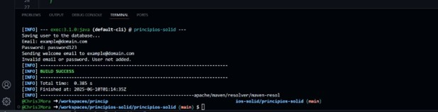
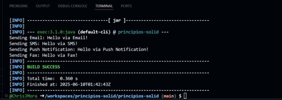
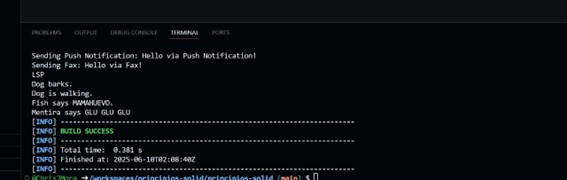
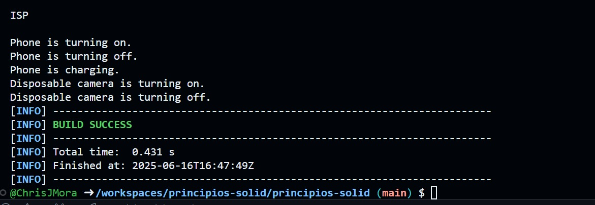
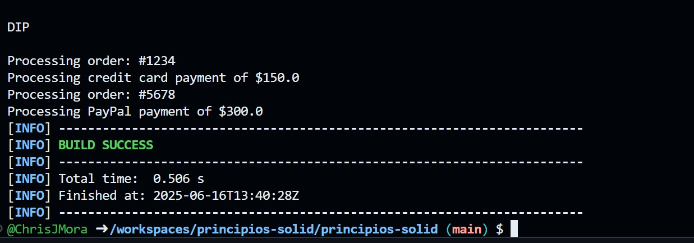

# Principios-solid

## Integrantes: Juan Araujo, Amy Cherrez, Christian Jacome, Mateo Jaramillo

## Evidencias de Ejecucion

### Ejercicio 1: Principio de Responsabilidad Única (SRP)

### Ejercicio 2: Principio Abierto/Cerrado (OCP)

### Ejercicio 3: Principio de Sustitución de Liskov (LSP)

### Ejercicio 4: Principio de Segregación de Interfaces (ISP)

### Ejercicio 5: Principio de Inversión de Dependencias (DIP)

